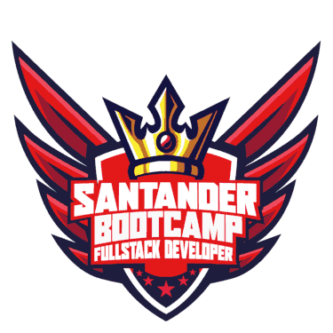

# Santander Bootcamp Fullstack Developer

Repositório destinado aos estudos do Bootcamp de Fullstack Developer realizado pela DIO em parceria com o Santander. 

## Links Úteis

### Lógica de Programação

- [Curso de Lógica de Programação](https://www.youtube.com/watch?v=8mei6uVttho&list=PLHz_AreHm4dmSj0MHol_aoNYCSGFqvfXV) :free:

### Linux

- [Curso de Linux - Primeiros Passos](https://www.youtube.com/watch?v=6nN2EglOqCM&list=PLHz_AreHm4dlIXleu20uwPWFOSswqLYbV) :free:

### Git/GitHub

- [Curso de Git e GitHub: grátis, prático e sem usar comandos no terminal](https://www.youtube.com/watch?v=xEKo29OWILE&list=PLHz_AreHm4dm7ZULPAmadvNhH6vk9oNZA) :free:
- [Blog do Professor Isidro](https://www.professorisidro.com.br/manual-de-sobrevivencia-do-github/) :free:
- [Manual de Sobrevivência do GitHub (Parte I)](https://www.youtube.com/watch?v=wh6HW3rDoWs) :free:
- [Manuel de Sobrevivência do GitHub (Parte II)](https://www.youtube.com/watch?v=_XuFI4ClKhw) :free:
- [Entendendo GIT | (não é um tutorial!)](https://www.youtube.com/watch?v=6Czd1Yetaac&t=1s) :free:
- [Usando Git Direito | Limpando seus Commits!](https://www.youtube.com/watch?v=6OokP-NE49k) :free:
- [Git e Github para Iniciantes](https://www.youtube.com/watch?v=IBClN6VpJDw&list=PLlAbYrWSYTiPA2iEiQ2PF_A9j__C4hi0A) :free:
- [Git e Github na Vida Real](https://www.youtube.com/watch?v=_Why5uCCrXc&list=PLlAbYrWSYTiNqugqFFWWsgONJsmc3eMpg) :free:

### Desenvolvimento Web (HTML5 + CSS3 + JavaScript)

- [Curso Web Moderno Completo com JavaScript 2022 + Projetos](https://www.udemy.com/share/1013eS3@PQplv7Ab1-Y8tvWdr3FVHfDM6r82eTlrQYMmFzyKeOIY1WW2bPh1AJ7gRbzgkfUZ/) :moneybag:
- [Curso de JavaScript e ECMAScript](https://www.youtube.com/watch?v=1-w1RfGIov4&list=PLHz_AreHm4dlsK3Nr9GVvXCbpQyHQl1o1) :free:
- [Mini-curso de TypeScript](https://www.youtube.com/watch?v=mRixno_uE2o&list=PLlAbYrWSYTiPanrzauGa7vMuve7_vnXG_) :free:
- [Curso HTML5 e CSS3 - Módulo 1](https://www.youtube.com/watch?v=Ejkb_YpuHWs&list=PLHz_AreHm4dkZ9-atkcmcBaMZdmLHft8n) :free:
- [Curso HTML5 e CSS3 - Módulo 2](https://www.youtube.com/watch?v=vPNIAJ9B4hg&list=PLHz_AreHm4dlUpEXkY1AyVLQGcpSgVF8s) :free:
- [Curso HTML5 e CSS3 - Módulo 3](https://www.youtube.com/watch?v=ofFgnDtn_1c&list=PLHz_AreHm4dmcAviDwiGgHbeEJToxbOpZ) :free:
- [Curso HTML5 e CSS3 - Módulo 4](https://www.youtube.com/watch?v=zHKHMmEG9vE&list=PLHz_AreHm4dkcVCk2Bn_fdVQ81Fkrh6WT) :free: