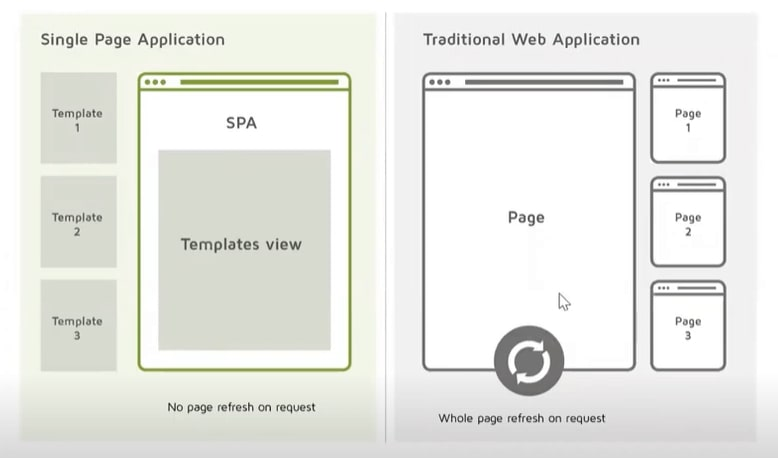
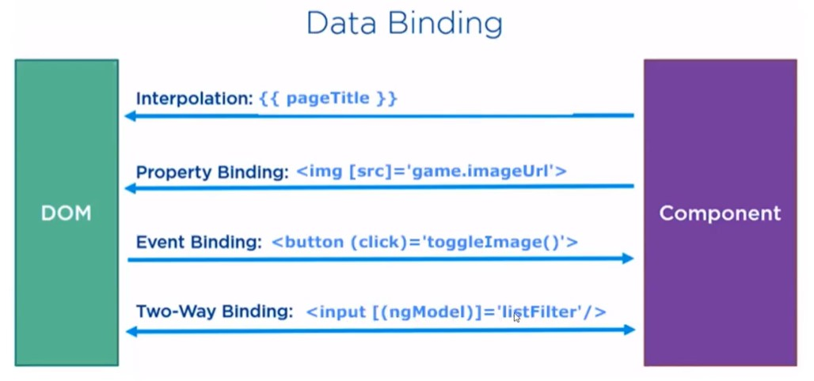
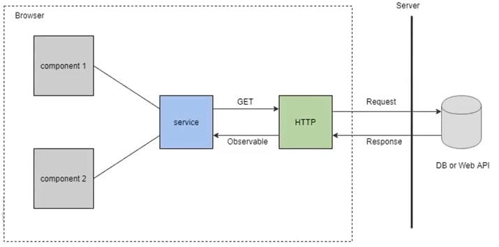
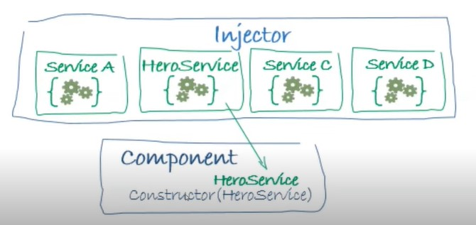

# Anotações sobre Angular

- As anotações e imagens foram baseadas/retiradas nos cursos ministrados durante o Santander Bootcamp Fullstack Developer.

## Introdução

- O Angular é um framework criado pelo Google focado na criação de aplicativos de página única (*Single Page Application*) eficientes e sofisticados.

- O modelo de *Single Page Application* (SPA) tem como objetivo fornecer para o usuário uma experiência semelhante à de um aplicativo Desktop. Todos os grandes sites são construídos nesse modelo: Instagram, Facebook, Twitter, YouTube etc.

- Imagina ter que carregar uma nova página para cada nova ação que o usuário for realizar dentro de um site?

  

- Para baixar o Angular: `npm install -g @angular/cli`.

- Executar o seguinte comando, via terminal, para criação da base do projeto em Angular: `ng new <nome-projeto>`.
  - Vai aparecer a seguinte mensagem: `Would you like to add Angular routing?`. Vamos digitar `No`, pois nesse primeiro momento não vamos adicionar o Módulo de Rotas.
  - Em seguida selecionaremos o CSS como padrão de estilo.
  - Então todas as dependências do projeto serão instaladas.

- Para inicializar o projeto, executamos o comando `ng serve -o`. O parâmetro `-o` é abreviação de `--open`, e ele indica que ao final do processo de compilação do projeto, o navegador web padrão do sistema operacional deve ser aberto para exibir a aplicação.
  - Porta padrão: `4200`.

## Estrutura

- Vamos entender um pouco sobre os principais arquivos e diretórios de um projeto Angular:

Arquivo/Diretório|Descrição
:---:|:---
`package.json`|Arquivo `.json` que contém todas as dependências do projeto no atributo `dependencies`. A medida em que novas dependências são instaladas, essas são automaticamente inseridas na lista. Podemos também configurar algumas dependências que vão ser utilizadas apenas durante a fase de desenvolvimento, em `devDependencies`. Outra possibilidade é a de criarmos *alias*, em `scripts`, para que seja possível executar comandos ou scripts através de atalhos.
`package-lock.json`|Arquivo `.json` que lista toda as dependências da aplicação e suas subdependências. 
`angular.json`|Arquivo `.json` que armazena configurações globais da aplicação. Em `main`, indicamos o arquivo responsável pela inicialização da aplicação. Em `assets`, inserimos a parte estática da aplicação, como por exemplo, imagens. Em `styles`, indicamos os arquivos responsáveis pelos estilos globais, que serão propagados em todos os componentes. Em `index`, informamos a página base da aplicação.
`node-modules`|Contém os arquivos das dependências instaladas pelo Angular npm. Exemplo: Bootstrap.
`src`|Contém os arquivos da aplicação.
`src/main.ts`|Arquivo que, por padrão, realiza a inicialização da aplicação, carregando o Módulo Raiz (AppModule).
`src/index.html`|Arquivo que, por padrão, contém a página base da aplicação.
`src/style.css`|Arquivo que, por padrão, contém os estilos globais da página.
`src/assets`|Diretório que, por padrão, armazena os arquivos estáticos da aplicação, como imagens, áudios, vídeos, fontes etc.
`src/app`|Diretório que armazena os Módulos, Componentes, Rotas, Serviços, Pipes e tudo o que fizer parte da aplicação.
`src/app/app.module.ts`|Arquivo do Módulo Raiz da aplicação. 
`src/app/app.component.ts`|Arquivo do Componente Raiz da aplicação.
`src/app/app.component.html`|Documento HTML do Componente Raiz.
`src/app/app.component.css`|Documento CSS do Componente Raiz. Essas configurações surtirão efeito apenas dentro do Componente e seus Filhos.

- Uma boa prática é que sempre que formos criar um arquivo, que seu nome expresse o que ele realmente faz.

- Todos os arquivos no Angular devem seguir o seguinte formato: `<nome>.<tipo>.<extensão>`.
  - `nome` se refere ao nome dado para o Componente, Módulo, Pipe, Serviço etc.;
  - `tipo` se refere a finalidade do arquivo: component, module, pipe, service etc.;
  - `extensão` pode ser `.html`, `.css` ou `.ts`.

## Componentes

- O Angular trabalha de forma modular. Esses Módulos funcionam como limitadores de contexto e nele são armazenados os Componentes, que são a parte vísivel da aplicação e que trazem vida ao Módulo.

- Os Componentes são blocos que sozinhos tem um sentido, eles podem ser únicos, ou um conjunto de vários outros Componentes.
  - Quando utilizamos da componentização, temos bastante ganhos, dois quais podemos citar: a reutilização de trechos de código, isolamento de contexto, legibilidade do código, redução de código e padronização do projeto.

  

- No início do arquivo, são listadas as importações das dependências do Componente. Logo abaixo, há um *Decorator*, que indica aquele arquivo como um Componente e armazena seus metadados, como indicar os seus templates de estilo internos (`styleUrls`), seu HTML (`templateUrl`), além do `selector`, que serve, a grosso modo, para mapear uma tag HTML à esse Componente. Por fim, tmbém há uma classe, que deve ser declarada como `NomeDoComponente + 'Component'` em formato Camel Case, onde declaramos as variáveis e métodos relacionadas àquele Componente.
  - O `selector` deve levar o mesmo nome do Componente. Uma convenção é utilizar o prefixo `app-` para identificarmos ele como personalizado, e não como nativo da linguagem ou importado por alguma biblioteca. 

  

- Cada Componente possui seu próprio diretório dentro de `src/app` e contém um arquivo de HTML, um de CSS e um de TypeScript.

- Você pode criar os componentes com um único comando: `ng g c <nome-componente>`. Com isso, um diretório será criado em `src/app` levando o nome do Componente e já contendo todos os arquivos apresentados anteriormente.
  - Esse comando não serve apenas para Componentes, podendo também criar Diretivas, Serviços, Pipes, Módulos etc.

- Podemos importar componentes prontos através da biblioteca **Angular Material**, que pode ser instalada através do seguinte comando: `ng add @angular/material`.
  - O Material Design é o padrão de design utilizado pelas aplicações da Google. O Angular Material aplica esse design para Componentes Angular 

## Data Binding

- O Angular fortifica o HTML e lhe da ainda mais poderes/recursos.

- Existem quatro formas de fazer a associação de valores entre Componentes e Templates.

  

1. Através da **Interpolação** (notação *double moustache*), conseguimos inserir valores das variáveis dos Componentes dentro do HTML: 

    ```
    <tag>{{ <atributo> }}</tag>
    ```

2. Quando queremos passar o valor da variável de um Componente para dentro do atributo de uma tag HTML, devemos colocar essa tag entre colchetes, para que o HTML entenda isso. Exemplo: a classe do nosso Componente possui um atributo `imageuRL` que armazena o URL de uma imagem que deve ser exibída no site. Para que o caminho da imagem seja inserido dentro de ``, devemos colocar a propriedade `src` entre colchetes.

    ```
    
    ```

3. Podemos mapear uma função do nosso componente para ser executada quando uma tag atinge determinada condição/estado. Exemplo: nosso Componente possui uma função chamada `save` que salva as alterações do formulário quando o mesmo é submetido. Para isso podemos fazer: 

    ```
    <button (click)="save">Save</button>
    ```

4. Com o conceito de **Two Way Data Binding** permite exibirmos e alterarmos, a partir de uma tag HTML, o valor de uma variável do do Componente. Exemplo: queremos exibir o valor de uma variável da Componente dentro de uma tag `<input>`, assim, o usuário poderia visualizá-la e caso altera-se o valor contido nesse campo, automaticamente o valor da variável era atualizado. 

    ```
    <input [(ngModel)]="<variavel>">
    ```

- Existe também o conceito de **One Way Data Binding**, semelhante ao apresentado anteriormente, com a diferença de que ele permite apenas exibirmos, a partir de uma tag HTML, o valor de uma variável do Componente. Ou seja, se utilizarmos essa técnica dentro de uma tag `<input>`, como no exemplo anterior, o valor da variável seria exibido dentro do campo, mas caso o usuário o altera-se, o valor da variável não era atualizado. 

    ```
    <tag [ngModel]="<variavel>">
    ```

- *Lembre-se: Quando utilizamos os **colchetes**, estamos fazendo uma comunicação no sentido `Lógica -> Template`. Quando utilizamos os **parênteses**, estamos fazendo uma comunicação no sentido `Template -> Lógica`.*

## Diretivas

- As diretivas fornecem meios para que possamos manipular o DOM ou estender as funcionalidades do elemento, sem a necessidade de utilizar JavaScript ou TypeScript.

- **Diretivas de Atributos:** alteram a aparência ou o comportamento de um elemento, componente ou outra diretiva, como por exemplo, `ngClass` e `ngStyle`.

- **Diretivas Estruturais:** Modificam o layout adicionando ou removendo elementos do DOM, como por exemplo, `ngIf` e `ngFor`.

- Podemos também ter diretivas personalizadas.

1. `ngStyle`:

     - Essa Diretiva permite alterar o estilo de tags.
       - Exemplo:
         ```
         <div [ngStyle]="{ background: count < 5 ? 'red' : 'green' }">...</div>
         ```
       - No exemplo acima, caso `count` seja menor que 5, o `background` da `<div>` será vermelho, caso contrário, o valor aplicado será o verde.

2. `ngClass`:
   
      - Essa Diretiva permite a inserção de classes nas tags, caso determinada condição seja verdadeira.
        - Exemplo:
          ```
          /* No CSS */

          .custom {
            color: #fff;
            font-weight: bold;
            font-style: italic;
          }
          ```
          ```
          <!-- No HTML -->

          <div [ngStyle]="{ custom: count > 5 }">...</div>
          ```
        - No exemplo acima, caso `count` seja maior que 5, a classe `custom` é adicionada em `<div>`. 

3. `ngIf`:

      - Essa Diretiva permite determinarmos uma condição dentro da tag para que ela e seu conteúdo interno sejam renderizados apenas em casos positivos.
        - Exemplo:
          ```
          <div *ngIf="count >= 7">...</div>
          ```
        - No exemplo acima, a `<div>` e seu conteúdo interno serão renderizados apenas quando `count` for maior ou igual a 7.
        - É possível inserir uma espécie de `else`:
          ```
          <div *ngIf="count >= 7; else menor">...</div>
          <ng-template #menor>...<ng-template>
          ```
        - No exemplo acima, enquanto `count` for menor do que 7, o conteúdo interno da tag `ng-template` será exibído em `<div>`. Quando `count` atingir o valor de 7, o conteúdo interno de `ng-template` será ocultado e o conteúdo interno de `<div>` renderizado.

4. `ngSwitch`:

      - Essa Diretiva permite utilizarmos a lógica do `switch`, uma estrutura condicional já conhecida das linguagens de programação tradicionais, diretamente no template HTML.
        - Exemplo:
        ```
        <ul [ngSwitch]="count">
	        <li *ngSwitchCase="3">...</li>
          <li *ngSwitchCase="6">...</li>
          <li *ngSwitchCase="9">...</li>
          <li *ngSwitchDefault>...</li>
        </ul>
        ```
        - No exemplo acima, caso `count` possua o valor 3, o conteúdo do primeiro `<li>` será exibído. Quando `count` valer 6, o segundo será renderizado, e da mesma forma, assim que atingir valor de 9, o terceiro aparecerá. Caso nenhuma das opções possibilidades seja atendida, o `<li>` com a Diretiva `*ngSwitchDefault` será exibído.   

5. `ngFor`:

   - Imagine um caso hipotético onde desejamos inserir dinamicamente uma tabela em nosso site. Utilizando JavaScript, desenvolveríamos uma função que recebe a lista de todos os valores que devem ser incluídos na tabela e iterariamos sobre ela, utilizando uma estrutura de repetição, e criariamos a estrutura da tabela e adicionaríamos no HTML da página utilizando métodos de manipulação da DOM como `createElement` e `insertChild`. O Angular, pra evitar toda essa escrita de código, possui uma Diretiva chamada `*ngFor`, que você adiciona na tag que você deseja iterar, e essa e todo seu conteúdo interno serão duplicados.

     ```
         <tr *ngFor="let element of list">
           <td>{{ element.attr1 }}</td>
           <td>{{ element.attr2 }}</td>
           <td>{{ element.attr3 }}</td>
           <td>{{ element.attr4 }}</td>
         </tr>
     ```

   - Serão geradas `list.length` linhas na tabela, cada uma delas correspondente a um elemento da lista.

## Comunicação entre Componentes

- Podemos passar passar valores de variáveis entre Componentes utilizando as diretivas `@Input()` e `@Output()`. Utilizamos o primeiro caso quando queremos passar o valor de um Componente pai para o filho e o segundo para o cenário inverso.

- Exemplo: temos um `Componente A` pai com a variável `valorA = 10` e um `Componente B` filho com a variável `valorB = 20`.

1. Para sobrescrevermos o valor de `B`, inserimos a diretiva `@Input()` no corpo da sua classe, o que permite que suas variáveis recebam valores de entrada de seu Componente Pai. Para passar o valor, utilizamos a ideia de *Data Binding* no `selector` do `Componente B`:

    ```
    export class ComponenteA implements OnInit {
      valorA: number;

      ngOnInit() {
        this.valorA = 10;
      }
    }
    ```

    ```
    export class ComponenteB implements OnInit {
      @Input() valorB: number = 20;
    }
    ```

    ```
    <componente-b [valorB]="valorA"></componente-b>
    ```

2. Para sobrescrevermos o valor de `Componente A`, inserimos a diretiva `@Output()` no corpo do `Componente B` e atribuimos à sua variável que vai enviar os valores para `A`, um objeto do tipo `EventEmitter`, responsável por fazer o envio desses dados. Para emitir um valor de `B` para `A`, é necessário invocar o método `emit` de `EventEmitter`, passando como argumento o valor que deve ser repassado a variável de A. Para passar o valor, utilizamos a ideia de *Data Binding* no `selector` do `Componente B`, conforme imagens abaixo:
   - Devemos chamar o método `enviaValorParaA` dentro do `Componente B` (através de um clique, por exemplo) para que o valor seja emitido para `A`. 

    ```
    export class ComponenteA implements OnInit {
      valorA: number = 10;

      atualizaValorDeA(novoValor: number) {
        this.valorA = novoValor;
      }
    }
    ```

    ```
    export class ComponenteB implements OnInit {
      @Output() valorB = new EventEmitter<number>();

      enviaValorParaA(valor: number) {
        this.valorB.emit(valor);
      }
    }
    ```

    ```
    <componente-b (valorB)="atualizaValorDeA($event)"></componente-b>
    ```

## Lifecycle Hooks

- Todo componente no angular tem um conjunto de eventos de ciclo de vida (Lifecycle Hooks) que ocorrem quando um componente é criado, renderizado, tem o valor de suas propriedades alteradas ou é destruído. o Angular invoca uma séries de métodos (Hooks), que são executados no momento em que esses eventos são acionados.

- Exemplos são o `OnInit` e o `OnChanges`, que quando implementados nas classes de Componentes, permitem definirmos seus comportamento quando o Componente e inicializado e quando há uma mudança de estado, respectivamente.

- Use com sabedoria para não comprometer a performance da sua aplicação.

- `ngOnInit` vs `constructor`: devemos utilizar o `constructor` apenas para inicializar serviços via Injeção de Dependências, enquanto o `ngOnInit` utilizamos para determinar as lógicas que devem ser executadas após a criação do Componente.

## Serviços e Injeção de Dependências

- Um Serviço Angular reutilizável é projetado para encapsular a lógica de negócios e os dados com diferentes componentes do Angular. É basicamente uma classe que tem um propósito bem definido para fazer algo. Você pode criar uma classe de serviço para dados ou lógica que não está associada a nenhuma visualização específica para compartilhar entre os componentes.

  

- Se você escrever toda a lógica de negócios em componentes, terá os seguintes problemas:
  - Você não poderá reutilizar essa lógica em nenhum outro lugar e terá que recodificar toda a lógica no componente destino;
  - A manutenção de seus componentes será difícil, pois você terá que manter duas cópias do mesmo código.
 
- Fazemos a injeção de dependências utilizando o *Decorator* `@Injectable` no arquivo do serviço, e inserimos a propriedade `providedIn: root` para que esse Serviço seja carregado assim que o módulo raiz for inicializado (É possível determinar em qual módulo ele será carregado, mas esse é um assunto mais avançado). Assim, quando o Módulo Raiz for inicializado, uma única instância desse Serviço será criada e ficará disponível para uso por parte dos Componentes pertencentes a esse Módulo.

  ```
  @Injectable({
    providedIn: root
  })
  ```

- Para ter acesso a todos os recursos de um Serviço, o componente deve invocá-lo através do construtor de sua classe.

  

  ```
  constructor(private myService: MyService) { }
  ```

- Nesse momento, `myService` é um atributo da classe do Componente, que armazena todos os recursos que a classe `MyService` do serviço dispõe.

- Não é interessante mantermos variáveis que podem ter seu valor alterado dentro de uma classe de um serviço injetável, já que está é compartilhada entre vários componentes. O ideal é que hajam apenas métodos que realizam operações e no máximo constantes.
  
## Pipes

- Utilizamos Pipes para alterar a forma de exibição de alguma propriedade do nosso Componente.

- Existem Pipes nativos do Angular, como o `date`, que nos permite formatar datas e o `lowercase`, que permite alterarmos todos os caracteres de uma propriedade para caixa baixa.

- Seguindo o padrão para nome de arquivos, devemos deixar claro o propósito do script. Exemplo: Queremos criar um Pipe para fazer a substituição de caracteres de uma string (exatamente como um `String.replace()` em JavaScript faz). Nesse caso, devemos criar um arquivo dentro do diretório `src/app/pipe` com o nome de `replace.pipe.ts`.

- Para indicarmos que aquele arquivo corresponde a um Pipe, devemos utilizar um *Decorator* `@Pipe` e dentro dele indicarmos o nome do pipe, através da propriedade `name`.

  ```
  @Pipe({
    name: 'replace'
  })
  ```

- A classe `ReplacePipe` deve implementar o método `transform` de `PipeTransform`, onde é especificado o que aquele Pipe faz.

## Rotas

- Em uma SPA, precisamos navegar pelos componentes para acessar diferentes conteúdos do site. Essa navegação é realizada através do módulo de rotas.

- Não utilizaremos mais tags personalizadas para identificar o ponto onde os componentes são dispostos, ou seja, não será mais preciso o uso da propriedade `selector` dentro dos *Decorators* `@Component`. Vale ressaltar que isso é apenas para os componentes que representam seções do site. Ou seja, componentes que estão dentro de outros componentes continuarão usando a propriedade `selector` e sendo dispostos no HTML através de tags personalizadas.
  
- Utilizaremos a tag `<route-outlet>` para identificar no site o ponto onde será feita a troca (*switch*) de Componentes.

- É necessário importa o Módulo de Rotas em `app.module.ts`.

- Na importação do Módulo, é utilizado o método `forRoot`, que recebe objetos que representam as rotas da nossa aplicação.

- Existem duas rotas padrões no Angular, a rota com **string vazia**, que representa a rota quando nenhum caminho é passado na requisição do site e o **\*\***, que é quando há a tentativa de acessar um **conteúdo que não existe**.

  ```
  imports: [
    .
    .
    .
    RouterModule.forRoot([
      { path: '', redirectTo: 'initialContent', pathMatch: 'full' },
      { path: 'initialContent', component: initialContentComponent },
      { path: '**', component: Error404Component}
    ])
    .
    .
    .
  ],
  ```

- Em `path` especificamos o caminho passado na URL e em `component`, qual o componente correspondente a aquela rota, que será alocado em `<route-outlet>`.

- No caso da rota onde não foi passado nenhum caminho, o browser é redirecionado para o conteúdo contido na Componente `InitialContentComponent`.

- Para alterar a rota ativa (ou seja, alterar o componente ativo) através de uma tag de link, utilizamos a seguinte propriedade: `<a [routerLink]="['path', 'pathVariable']"></a>`. Em `path`, passamos a nova rota, enquanto `pathVariable` é opcional, onde você pode passar algum parâmetro, como por exemplo, o id do produto que você deseja exibir.

- Se optarmos por adicionar o Módulo de Rotas na criação do projeto, será criado um arquivo chamado `app-routing.module.ts` em `src/app`, onde podemos listar todas as rotas da nossa aplicação, em um arquivo separado.

## Formulários e variáveis de template

- Podemos utilizar **variáveis de template** para armazenar valores de variáveis do componente ou diretivas do Angular, dentro de tags HTML. Exemplo: Queremos pegar a propriedade `ngForm` para manipular o formulário do nosso site (exemplo: verificar se todos os campos do formulário são válidos). Para isso podemos fazer: `<form #myForm="ngForm">...</form>`, sendo `#myForm` a variável de template.

## HTTP

- O Angular já possui o módulo `HttpClientModule`, que permite realizar requisições HTTP sem a necessidade de instalar bibliotecas externas, como ocorre no JavaScript que necessita da importação de uma biblioteca, como por exemplo, o `axios`.
  - Permite fazer as principais operações HTTP: POST, GET, PUT, DELETE;
  - É necessário realizar a injeção de dependência desse módulo dentro do componente que você deseja utilizá-lo.

- Os métodos HTTP permitem três parâmetros na sua chamada: URL da API, o body da requisição e as opções (que inclui o header, com diferentes configurações que podem ser feitas).

- O retorno do método é um `Observable`. Ele possui uma estrutura semelhante as `Promises`, com a diferença que o `Observable` permite nos inscrevermos para receber dados de forma contínua, sem a necessidade de se conectar toda vez através do mesmo endereço para receber os dados.
  - Esse `Observable` encapsula a resposta da requisição, logo, na chamada da função, é necessário especificar o retorno esperado.
  - Exemplo:

    ```
    getUser(): Observable<User> {
      return this.httpClient.get<User>(url, body, opts);
    }
    ```

- Na chamada desse método que retorna um Observable, é necessário realizar uma inscrição para receber a resposta, através do método `subscribe`. Esse método possui um comportamento semelhante ao `then` das `Promises`.
  - Esse método `subscribe` pode receber três parâmetros que são três funções callback: 
    - `next`, que informa o que deve ser feito caso o método seja executado com sucesso;
    - `error`, que informa o que deve ser feito caso o método falhe; e
    - `complete`, que informa o que deve ser executado após `next`.

      ```
      getUser().subscribe({
        next: response => ...,
        error: err => ...,
        complete: () => ...
      });
      ```

- Uma boa prática é criar `models`, sejam eles Type Alias, Interfaces ou Classes para determinar o tipo de resposta da API que o seu programa está esperando.

- O `sheet.best` é uma ferramenta que nos permite transformar planilhas online utilizando o Google SpreadSheet, por exemplo, em banco de dados, e manipular seus dados através de uma API.

## Módulos

- Como já explicado anteriormente, os módulos funcionam como limitadores de contexto. Logo, é uma boa prática segregar os componentes da sua aplicação em módulos para que esses consigam fazer comunicação apenas com aqueles que fazem parte de um mesmo contexto.

- Analogia: O Módulo Raiz é uma casa, e os Módulos Filhos funcionam como os cômodos da casa. Os objetos existentes em cada um desses cômodos são os Componentes, que fisica,emye fazem parte apenas daquela área (contexto).

- O arquivo do Módulo apresenta na parte mais acima todos os Componentes e Módulos que são importados para ele. Logo abaixo, há o *Decorator* `@NgModule` onde, devem ser declarados todos os Componentes utilizados internamente (`declarations`), assim como outros módulos (`imports`).

  ```
  @NgModule({
    declarations: [...],
    imports: [...]
  })
  ```

- Nesse momento, os componentes desse módulo podem ser removidos do módulo raiz e seu nome inserido na lista de módulos (vai dar erro se você manter os componentes declarados tanto no Módulo Raiz quanto no Filho).

- Error comuns na criação de módulos:
  - Manter o componente declarado tanto no módulo raiz quanto no seu módulo personalizado;
  - Não importar o módulo `CommonModule` que contém as funcionalidades básicas do Angular.

## Diretório shared

- Como forma de organização dos arquivos da nossa aplicação, podemos criar um diretório com o nome `src/app/shared`, onde serão armazenados todos os Componentes e Pipes que podem ser reutilizados em diferentes contextos da aplicação.

- Os Componentes ficarão em `src/app/shared/components` e os Pipes em `src/app/shared/pipes`. Cada um dos Componentes terá seu próprio diretório.

- É interessante que cada Componente de `src/app/shared` seja declarado como um Módulo, havendo uma segregação de responsabilidade dentro da estrutura do projeto e fazendo com que declaremos apenas aquilo que de fato precisamos usar. Esse formato já é utilizado pelo próprio Angular, por exemplo, quando queremos realizar requisições HTPP, utilizamos o HttpModule, ou quando queremos manipular formulários, utilizamos o FormsModule.

- A príncipio os Pipes podem estar todos dispostos em um mesmo Módulo, porém, se você perceber que estão sendo gerados muitos Pipes, e cada um deles com contexto bem específico, então torna-se interessante assumir o mesmo modelo utilizado em Componentes, onde cada Pipe (ou conjunto de Pipes) possui seu próprio diretório e são divididos em Módulos diferentes.  

## Diretório core

- Podemos criar também o diretório `src/app/core`, onde serão armazenados os Componentes mais robustos, que possuem mais regras de negócio internas, e que dificilmente são compartilhados em diferentes contextos.

- Para cada um desses componentes, são criados Módulos.

## Produção

- *"A saída no final é JavaScript."*

- Para subirmos em produção o projeto, devemos executar o comando `ng build`.

- Nessa hora é gerado um *bundle*, onde o Angular concatena todos os arquivos gerados em um único JavaScript puro. O mesmo acontece o CSS. Esses arquivos gerados que devem ser colocados em produção para que o site funcione.

- O Angular é um framework, portanto, ele serve para facilitar o trabalho do desenvolvedor. Porém, os arquivos gerados através de um projeto Angular não são interpretados pelos servidores e navegadores, que entendem apenas HTML, CSS e JavaScript.

- O **Netlify** é uma ferramenta que permite a hospedagem de sites de forma gratuita.

## Links

- [Documentação Angular](https://angular.io/docs)
- [Angular Material](https://material.angular.io/)